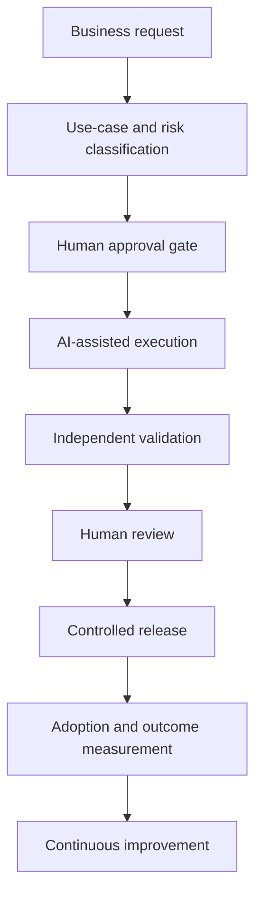

# Enterprise AI Adoption Case Study

A governance-first portfolio case study showing how an experimental AI-assisted workflow can be translated into a controlled, measurable and scalable enterprise adoption model for regulated financial-services environments across Asia.

> **Portfolio scope:** This repository is a sanitized case study. It contains no proprietary trading logic, market data, protected payloads, private research history, credentials or commercial publications.

## Why this project exists

Using generative AI successfully at enterprise scale is not mainly a prompting problem. It is an operating-model problem involving governance, ownership, change management, user capability, risk controls and measurable business outcomes.

This case study demonstrates how I approached those challenges through a controlled multi-agent workflow with:

- role-specific AI agents;
- human approval before material changes;
- read-only and write responsibilities separated;
- deterministic task contracts and path allowlists;
- independent validation and review;
- fail-closed escalation when evidence is missing;
- audit trails, rollback plans and decision records;
- adoption metrics that distinguish activity from business value.

## Executive summary

The underlying private project began as an AI-assisted quantitative-research environment. Rather than allowing unrestricted agent activity, I designed a governed delivery workflow around five specialized read-only agents:

| Agent | Responsibility |
|---|---|
| `repo_preflight` | Confirms repository state, authority and task prerequisites |
| `evidence_collector` | Collects approved evidence without changing the repository |
| `validator` | Checks outputs, boundaries, schemas and change allowlists |
| `pr_reviewer` | Independently reviews governance alignment and quality |
| `missing_file_handler` | Fails closed and escalates when required evidence is unavailable |

The parent process remains the only writer, while humans retain final authority over approvals and releases.

## Operating model

## Enterprise mapping

| Enterprise AI-adoption concept | Case-study implementation |
|---|---|
| Use-case intake | Structured task contract |
| Role-based access | Read-only agent permissions |
| Human-in-the-loop control | Explicit approval gates |
| Independent assurance | Validator and PR reviewer |
| Auditability | Decision records and evidence artifacts |
| Change control | Draft pull requests and exact path allowlists |
| Risk containment | Fail-closed boundaries |
| Reversibility | Rollback manifests and baseline checks |
| Scaling | Reusable templates and operating standards |

## Repository guide

- [`docs/01_business_problem.md`](docs/01_business_problem.md) — business context and adoption challenge
- [`docs/02_adoption_strategy.md`](docs/02_adoption_strategy.md) — phased adoption approach
- [`docs/03_operating_model.md`](docs/03_operating_model.md) — roles, decision rights and lifecycle
- [`docs/04_responsible_ai_governance.md`](docs/04_responsible_ai_governance.md) — responsible-AI and risk controls
- [`docs/05_custom_agent_architecture.md`](docs/05_custom_agent_architecture.md) — multi-agent design
- [`docs/06_change_management.md`](docs/06_change_management.md) — people, communications and capability building
- [`docs/07_asia_localization.md`](docs/07_asia_localization.md) — regional-core and local-market model
- [`docs/08_measurement_framework.md`](docs/08_measurement_framework.md) — adoption and value metrics
- [`docs/09_lessons_learned.md`](docs/09_lessons_learned.md) — practical lessons and limitations
- [`examples/`](examples/) — reusable governance and adoption templates
- [`demo/read_only_multi_agent_workflow/`](demo/read_only_multi_agent_workflow/) — sanitized workflow walkthrough

## What this repository does not claim

- It is not a production AI platform.
- It is not a live-trading system.
- It contains no performance or profitability claim.
- It does not represent deployment within any named employer.
- Templates and metrics are illustrative until applied to a defined business workflow.

## Portfolio narrative

This work demonstrates my ability to move from individual AI experimentation to a repeatable enterprise operating model by combining technology delivery, responsible-AI controls, stakeholder governance, change management and outcome measurement.

## Licence

Code and documentation in this repository are licensed under the [Apache License 2.0](LICENSE), unless a file states otherwise.
