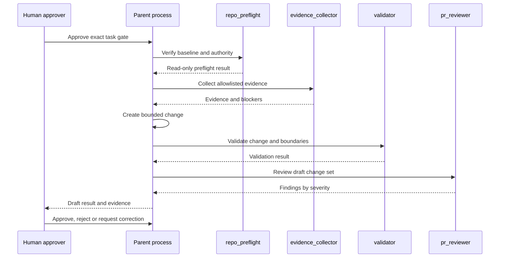

# Read-Only Multi-Agent Workflow Demo

This sanitized walkthrough illustrates the control flow used in the case study. It does not connect to the private source repository and does not execute AI agents.

## Scenario

A business owner asks for an AI-assisted change to a controlled repository.

## Workflow



## Example control record

```yaml
gate: APPROVE_EXAMPLE_DOCUMENTATION_CHANGE_ONLY
baseline: exact-approved-commit
parent_is_only_writer: true
agents:
  repo_preflight: read-only
  evidence_collector: read-only
  validator: read-only
  pr_reviewer: read-only
max_agent_depth: 1
nested_agents: false
automatic_next_action: false
human_final_authority: true
```

## Why this matters

The architecture limits common AI-delivery risks:

- execution begins from an unverified baseline;
- an agent reads data outside its authority;
- implementation certifies its own correctness;
- a missing file is replaced by an unsupported assumption;
- one completed task silently authorises the next;
- repository changes cannot be traced to an approval.

## Enterprise adaptation

For a real business workflow, replace repository paths with approved systems, data sources and decision rights. The same principles remain:

1. classify the use case;
2. approve the evidence and data boundary;
3. separate execution and validation;
4. keep humans accountable;
5. measure outcomes;
6. stop when authority is missing.
