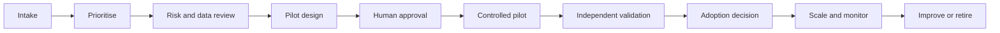

# 3. AI Adoption Operating Model

## Decision rights

| Role | Primary accountability |
|---|---|
| Executive sponsor | Strategic alignment, funding and risk appetite |
| Business owner | Workflow outcome and benefit realisation |
| AI adoption lead | Portfolio, rollout, capability and measurement |
| Technology | Platform, integration, support and resilience |
| Risk/compliance/legal/privacy | Policy interpretation and control assurance |
| Data owner | Permitted use, quality and access boundaries |
| Local-market lead | Regulation, language and process localisation |
| End user | Responsible use, feedback and escalation |

## Lifecycle

## Required controls by stage

### Intake

- named business problem;
- accountable owner;
- user population;
- baseline metric;
- initial data classification.

### Pilot approval

- exact scope;
- permitted systems and data;
- human-review requirement;
- model limitations;
- acceptance and stop criteria;
- incident route.

### Scale approval

- pilot evidence;
- training and support plan;
- local-market assessment;
- monitoring and ownership;
- benefit-realisation plan;
- rollback or retirement plan.

## Separation of duties

The case-study workflow separates:

- execution from approval;
- evidence collection from repository writing;
- implementation from validation;
- technical success from business-adoption success.

This reduces the risk of an AI workflow approving its own output or expanding its own authority.

## Governance cadence

Recommended forums:

- weekly pilot delivery review;
- monthly adoption and value review;
- quarterly risk and portfolio review;
- event-driven incident and policy review.

Decision logs should capture who approved what, using which evidence, under which boundary and with which follow-up action.
