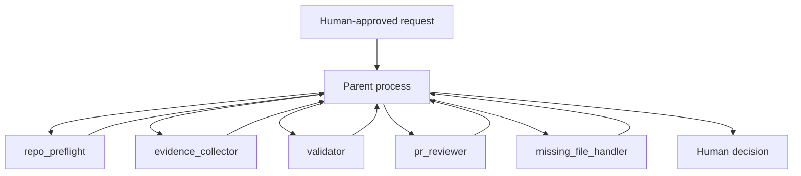

# 5. Custom-Agent Architecture

## Design objective

The architecture demonstrates how multiple AI agents can contribute specialist analysis without receiving unrestricted authority.

## Agent roles

### `repo_preflight`

Confirms repository, branch, baseline, permissions and task prerequisites before work begins.

### `evidence_collector`

Reads only the approved evidence surface and distinguishes direct evidence from inference.

### `validator`

Independently checks schemas, status markers, boundaries, path allowlists and deterministic acceptance criteria.

### `pr_reviewer`

Reviews the final change set for logic, governance alignment and unresolved risk.

### `missing_file_handler`

Stops the workflow and escalates when required evidence is missing; it does not invent a substitute.

## Permission model

| Capability | Read-only agents | Parent process | Human reviewer |
|---|---:|---:|---:|
| Read approved evidence | Yes | Yes | Yes |
| Broaden scope | No | No without approval | Yes |
| Write repository files | No | Yes within gate | No direct automation |
| Approve release | No | No | Yes |
| Invoke nested agents | No | No by default | May approve a separate design |
| Merge changes | No | No without approval | Final authority |

## Key design choices

- **Depth limited to one:** prevents uncontrolled delegation chains.
- **Parent-only writes:** preserves a single accountable change surface.
- **Independent validation:** implementation does not self-certify.
- **Exact task contracts:** each agent receives a bounded purpose and evidence surface.
- **Fail closed:** ambiguity or missing evidence causes a stop.
- **No automatic next action:** completion of one stage does not authorize the next.

## Enterprise application

The same pattern can support controlled AI use in policy review, knowledge management, software delivery, operations and internal productivity workflows, provided data access and decision rights are redesigned for the specific use case.
