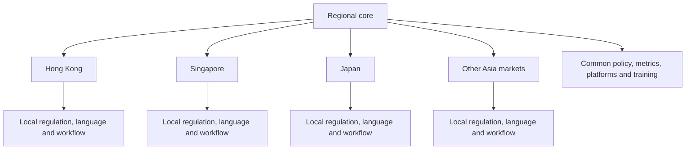

# 7. Asia Localisation Model

## Regional core, local execution

Enterprise AI adoption across Asia benefits from a common regional foundation combined with explicit local-market adaptation.

## Regional-core responsibilities

- common responsible-AI principles;
- approved platforms and model standards;
- shared risk taxonomy;
- reusable use-case assessment;
- core training curriculum;
- regional adoption dashboard;
- common incident and escalation process;
- reusable technical and governance patterns.

## Local-market responsibilities

- local legal and regulatory interpretation;
- data residency and cross-border constraints;
- language and cultural adaptation;
- market-specific customer and distribution workflows;
- local works-council or employee considerations where relevant;
- local sponsor and champion network;
- local benefit validation.

## Localisation checklist

1. Is the use case permitted locally?
2. Can required data be processed in the approved environment?
3. Does the workflow support the relevant language and terminology?
4. Are outputs understandable to local users and customers?
5. Does human oversight align with local roles and accountability?
6. Are training and support available in suitable formats?
7. Can outcomes and incidents be reported consistently to the region?

## Scaling principle

Standardise the control framework and reusable components; localise the workflow, language, evidence and regulatory interpretation. Localisation should not weaken regional minimum controls.

## Rollout pattern

- start with two or three representative markets;
- select markets with strong sponsorship and measurable workflows;
- compare common and local friction;
- update the regional playbook;
- scale in waves rather than launching everywhere simultaneously.
